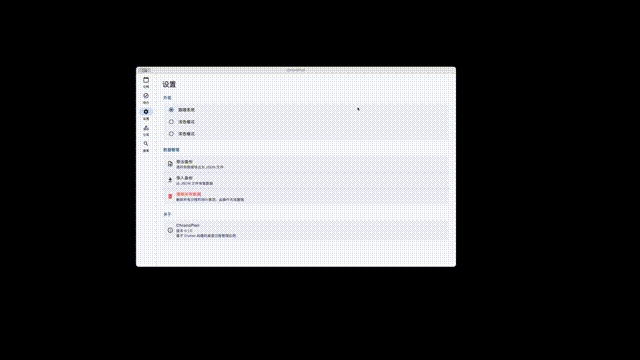

## ChronoPlan（桌面端日历 · 日程 · 待办）

ChronoPlan 是一个使用 **Flutter** 构建的个人效率桌面应用，提供日历视图、日程/待办管理与分类体系，并支持重复规则、农历展示、数据导入导出与全局搜索。

### 演示


### 功能特性
- **日历视图**：月视图日历 + 当天日程列表
- **农历显示**：农历日期/节日/节气展示（含“休/班”角标）
- **日程管理**：新建/编辑/删除、完成状态、分类颜色条展示
- **重复规则**：每周/每月/每年；支持“固定日期”的月/年重复场景
- **待办管理**：新建/编辑/删除、完成状态、分类
- **分类管理**：日程/待办分别管理；名称校验与同类型下唯一性
- **全局搜索**：按关键字搜索日程与待办
- **数据导入导出**：JSON 备份与恢复（含分类数据）

### 技术栈
- **Flutter / Dart**
- **Riverpod**（状态管理）
- **Isar**（本地数据库）
- **TableCalendar**（日历组件）
- **rrule**（重复规则）
- **lunar**（农历与节假日/调休信息）

### 项目结构（简化）
- `lib/src/features/calendar`：日历与日程
- `lib/src/features/tasks`：待办
- `lib/src/features/categories`：分类管理
- `lib/src/features/search`：全局搜索
- `lib/src/features/settings`：设置/导入导出
- `lib/src/core`：路由、主题、数据库等

### 开发环境要求
#### 通用
- **Flutter（stable）**：建议与 CI 保持一致（当前 CI 使用 `3.38.3`）
- **Dart**：随 Flutter 自带
- **代码生成**：本项目使用 Isar / Riverpod 的生成代码，开发或打包前请运行：

```bash
dart run build_runner build --delete-conflicting-outputs
```

#### macOS（桌面端）
- **macOS**：建议 macOS 13+（CI 使用 macOS 15）
- **Xcode**：用于编译 macOS 桌面应用（`flutter build macos`）
- **CocoaPods**：`flutter build macos` 会用到（Xcode 环境一般已包含/可安装）

#### Windows（桌面端）
- **Windows**：建议 Windows 10/11
- **Visual Studio 2022**：安装 **Desktop development with C++**（MSVC、Windows SDK、CMake 工具链）
- **CMake/Ninja**：通常随 VS 安装；用于构建 Windows Runner（`flutter build windows`）

### 本地运行（macOS）
```bash
flutter pub get
dart run build_runner build --delete-conflicting-outputs
flutter run -d macos
```

### 本地打包
#### macOS（Release）
```bash
flutter build macos --release
```
产物：`build/macos/Build/Products/Release/*.app`

#### Windows（Release，需在 Windows 机器/CI 上）
```bash
flutter build windows --release
```
产物：`build/windows/x64/runner/Release/`

### CI 自动打包（推荐）
本项目已内置 GitHub Actions：自动构建并产出
- macOS：**DMG**
- Windows：**安装包 EXE（Inno Setup）**

详见：`docs/ci_desktop_release_guide.md`

### 贡献
欢迎提交 Issue / PR。请先阅读：
- `CONTRIBUTING.md`
- `CODE_OF_CONDUCT.md`

### 安全
如发现安全问题，请按 `SECURITY.md` 中的流程反馈。

### 许可证
本项目采用 **MIT License**，详见 `LICENSE`。


